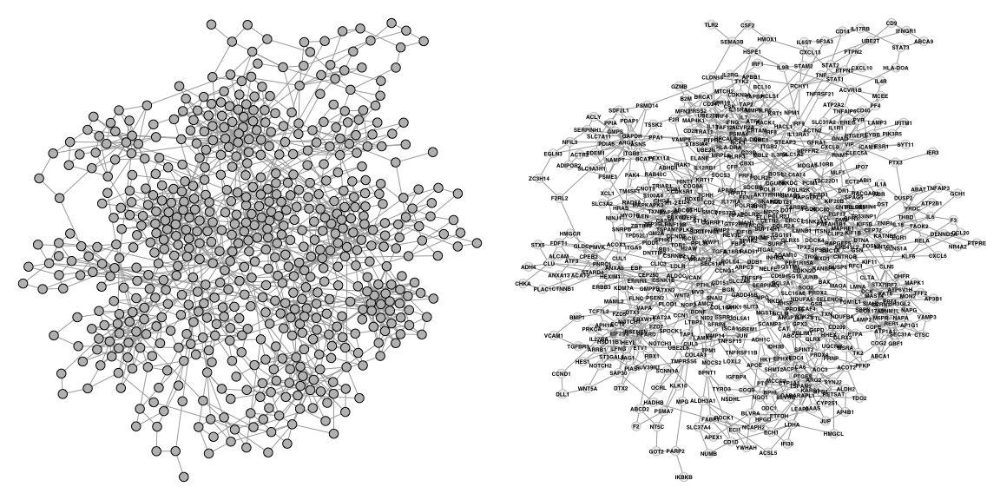

<!-- README.md is generated from README.Rmd. Please edit that file -->

# Network Enrichment

An extension of hypeR for network enrichment through random walks.

### Installation

``` r
devtools::install_github("anfederico/network-enrichment")

library(network.enrichment)
```

### Example Data

To get a sense of how this works, there is a simulated network with
modular scale-free properties available. The object already has
pre-defined communities that have been populated with genes from highly
specific biological pathways. This data was generated through the
following steps:

1.  Simulate a graph structure through the
    Lancichinetti–Fortunato–Radicchi (LFR) benchmark model
2.  Detect and define communities within the graph
3.  For each community sample node labels from a biological pathway
    (80%) / random (20%)

<!-- end list -->

    LFR(n=600, tau1=2.7, tau2=2, mu=0.1, min_community=25, max_community=75)

``` r
data(ig)
print(ig)
```

    #> IGRAPH c935075 UN-- 600 1497 -- 
    #> + attr: community (v/n), color (v/c), label (v/c), name (v/c)
    #> + edges from c935075 (vertex names):
    #>  [1] GMPS  --PPIA    GMPS  --ACLY    GMPS  --GAPDH   GMPS  --ARG1   
    #>  [5] GMPS  --ITGB8   PDLIM1--G6PD    PDLIM1--PRDX4   PDLIM1--PRDX6  
    #>  [9] PDLIM1--ABCC1   PDLIM1--AHSP    PDLIM1--ANGPTL4 JUNB  --SOD2   
    #> [13] JUNB  --CAT     JUNB  --IL10RB  JUNB  --AHSP    RER1  --NAPA   
    #> [17] RER1  --NAPG    RER1  --COG2    RER1  --SCRN1   RER1  --COPE   
    #> [21] RER1  --PPT1    RER1  --ABCA1   RER1  --SIAH2   RER1  --MAST4  
    #> [25] ICAM1 --PIK3R5  ICAM1 --NUDT21  ICAM1 --GNAI3   ICAM1 --CD40   
    #> [29] ICAM1 --SYT11   NPFFR2--CXCL8   NPFFR2--SLC31A2 NPFFR2--IL1R1  
    #> + ... omitted several edges

``` r
set.seed(1)
layout <- igraph::layout_with_graphopt(ig, 
                                       start=NULL, 
                                       niter=1000,
                                       charge=0.005,
                                       mass=30, 
                                       spring.length=0,
                                       spring.constant=1, 
                                       max.sa.movement=5)

par(mar=c(0,0,0,0), mfrow=c(1,2))
plot(ig,
     vertex.size=4,
     vertex.color="grey",
     vertex.frame.color="black",
     vertex.label=NA,
     edge.width=1,
     layout=layout)

plot(ig,
     vertex.size=4,
     vertex.color="#EEEEEE",
     vertex.frame.color=adjustcolor("#000000", alpha.f=0.2),
     vertex.label=V(ig)$name,
     vertex.label.family="Helvetica",
     vertex.label.color="black",
     vertex.label.font=2,
     vertex.label.cex=0.4,
     vertex.label.dist=0,
     edge.width=1,
     layout=layout)
```

<!-- -->

The only thing your graph needs is unique node symbols that correspond
to the genesets you’re testing against.

``` r
head(V(ig)$name)
```

    #> [1] "GMPS"   "PDLIM1" "JUNB"   "RER1"   "ICAM1"  "NPFFR2"

### Community Detection

You need to perform some type of community detection. There are many
algorithms but I prefer defining community structure through random
walks. Walktrap looks for densely connected subgraphs through random
walks at varying lengths. Whatever algorithm you use, make sure to label
the nodes with their designated community through `V(ig)$community`.

``` r
set.seed(1)
ig.c <- igraph::walktrap.community(ig, steps=10)
V(ig)$community <- ig.c$membership
```

``` r
table(V(ig)$community)
```

    #> 
    #>  1  2  3  4  5  6  7  8  9 10 11 12 13 14 15 16 17 
    #> 24 42 33 41 37 34 29 25  4 66 43 55 27 26 33 45 36

We can visualize the communities which seem well-defined. Not
surprisingly since this example data was defined to be particularly
modular for demonstration purposes.

``` r
par(mar=c(0,0,0,0))
plot(ig,
     vertex.size=5,
     vertex.label=V(ig)$community,
     vertex.label.family="Helvetica",
     vertex.label.color="white",
     vertex.label.font=2,
     vertex.label.cex=0.6,
     vertex.label.dist=0,  
     edge.width=1,
     layout=layout)
```

<!-- -->

### Community Enrichment

Enrichment is performed independently for each community. Rather than
performing enrichment just on the community members, we want to account
for neighboring members outside but within close proximity to the
community. Therefore we perform network propagation seeded with the
community neighbors and performing enrichment on highly traversed
portions of the graph.

``` r
library(hypeR)
genesets <- hypeR::msigdb_gsets("Homo sapiens", "H", clean=TRUE)
```

``` r
data <- do.community(ig, community="16", genesets, restart=0.5, plotting=TRUE)
```

``` r
par(mar=c(0,0,0,0))
ig.c <- data$ig
plot(ig.c,
     vertex.size=4,
     vertex.color=V(ig.c)$pcolor,
     vertex.label=NA,
     edge.width=1,
     layout=layout)
```

<!-- -->

After traversing the network, we can define a ranked signature for this
community - sort of like an extended signature - based on the most
traversed nodes in the network.

``` r
signature.ranked <- V(ig.c)$p
names(signature.ranked) <- V(ig.c)$name
head(sort(signature.ranked, decreasing=TRUE))
```

    #>      EIF1B        ELL     NUDT21      ERCC5      SIAH1     SNAPC5 
    #> 0.02916435 0.02722562 0.02642275 0.02362867 0.02315903 0.02314451

This happens implicitly within this function.

``` r
hyp.c <- data$hyp
```

``` r
hyp.c$plots$`Dna Repair`
```

<!-- -->

``` r
hypeR::hyp_dots(hyp.c)
```

<!-- -->

The most important parameter will be the `restart` probability of the
random walks. This tells the algorithm how long the walks should be and
is the probability of the random walk restarting from the community. In
otherwords, this will define how fuzzy your extended signature for a
given community will be.

``` r
par(mar=c(0,0,0,0), mfrow=c(2,3))
for (restart in c(0.75, 0.5, 0.25, 0.1, 0.05, 0)) {
    data <- do.community(ig, community="16", genesets, restart=restart)
    ig.c <- data$ig
    plot(ig.c,
         vertex.size=4,
         vertex.color=V(ig.c)$pcolor,
         vertex.label=NA,
         edge.width=1,
         layout=layout)
    title(paste0("restart = ", restart), cex.main=2, font.main=4, line=-3)
}
```

<!-- -->

### Visualizing Results

One way to visualize enrichment of the network would be to repeat the
above process for each community

``` r
communities <- names(table(V(ig)$community))
lhyp <- mapply(function(community) {
    data <- do.community(ig, community=community, genesets, restart=0.5)
    return(data$hyp)
}, communities, SIMPLIFY=FALSE, USE.NAMES=FALSE)
names(lhyp) <- paste0("C", communities)

mhyp <- hypeR::multihyp$new(data=lhyp)
hypeR::hyp_dots(mhyp, merge=TRUE, top=50, fdr=0.01)
```

<!-- -->

Although we can also visualize the enrichment on the graph itself, which
will give some perspective on why some communities close to each other
might be enriched for similar pathways.

``` r
ig.e <- do.enrichment(ig, genesets, restart=0.5, fdr=0.01, top=1)
```

``` r
par(mar=c(0,0,0,0))
plot(ig.e,
     vertex.size=5,
     vertex.label=V(ig.e)$annotation,
     vertex.color=adjustcolor(V(ig.e)$color, alpha.f=0.3),
     vertex.frame.color=adjustcolor("#000000", alpha.f=0.2),
     vertex.label.family="Helvetica",
     vertex.label.color="black",
     vertex.label.font=2,
     vertex.label.cex=0.7,
     edge.width=1,
     layout=layout)
```

<!-- -->
